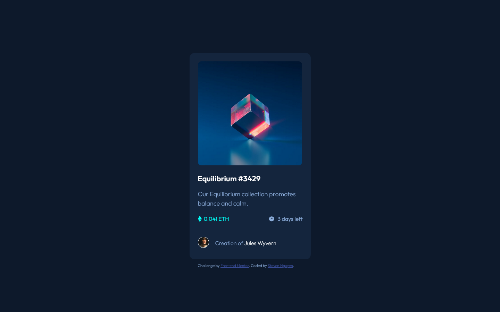
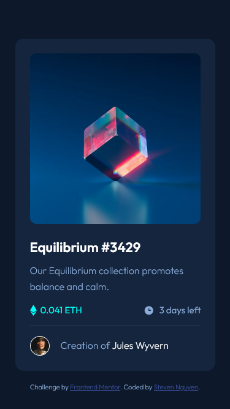

# Frontend Mentor - NFT preview card component solution

This is a solution to the [NFT preview card component challenge on Frontend Mentor](https://www.frontendmentor.io/challenges/nft-preview-card-component-SbdUL_w0U). Frontend Mentor challenges help you improve your coding skills by building realistic projects.

## Table of contents

- [Overview](#overview)
  - [The challenge](#the-challenge)
  - [Screenshot](#screenshot)
  - [Links](#links)
- [My process](#my-process)
  - [Built with](#built-with)
- [Author](#author)

## Overview

### The challenge

Users should be able to:

- View the optimal layout depending on their device's screen size
- See hover states for interactive elements

### Screenshot

#### Desktop screenshot

#### Mobile screenshot

### Links

- Solution URL: https://github.com/snguyen56/nft-preview-card-component-vanilla
- Live Site URL: https://snguyen56.github.io/nft-preview-card-component-vanilla/

## My process

### Built with

- HTML
- CSS
- Semantic HTML5 markup
- Mobile-first workflow
- [modern-normalize](https://github.com/sindresorhus/modern-normalize) - Normalized CSS File

## Author

- Website - https://snguyen56.github.io/
- Github - https://github.com/snguyen56
- LinkedIn - [Steven Nguyen](https://www.linkedin.com/in/steven-nguyen-bb5568216/)
- Frontend Mentor - [@snguyen56](https://www.frontendmentor.io/profile/snguyen56)
